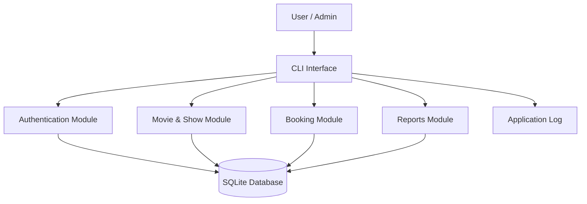
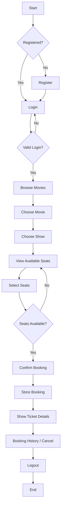
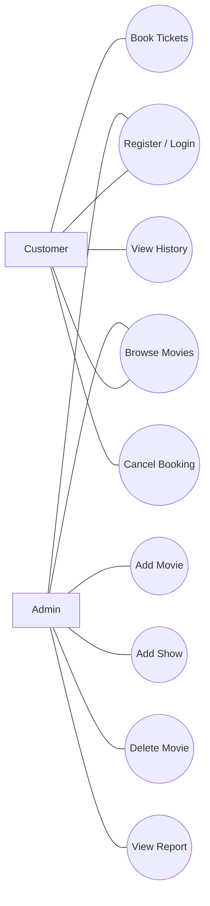
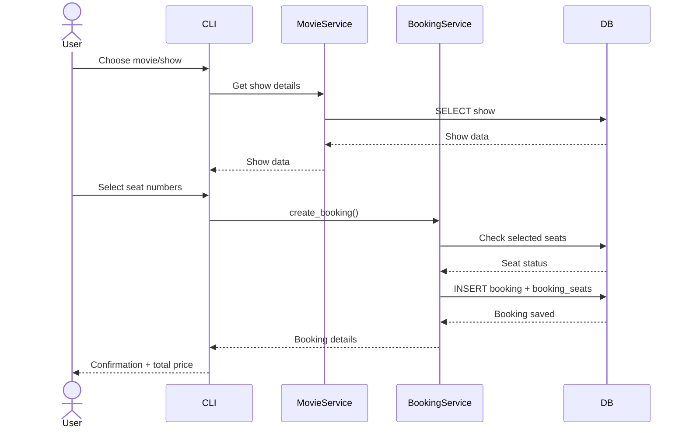
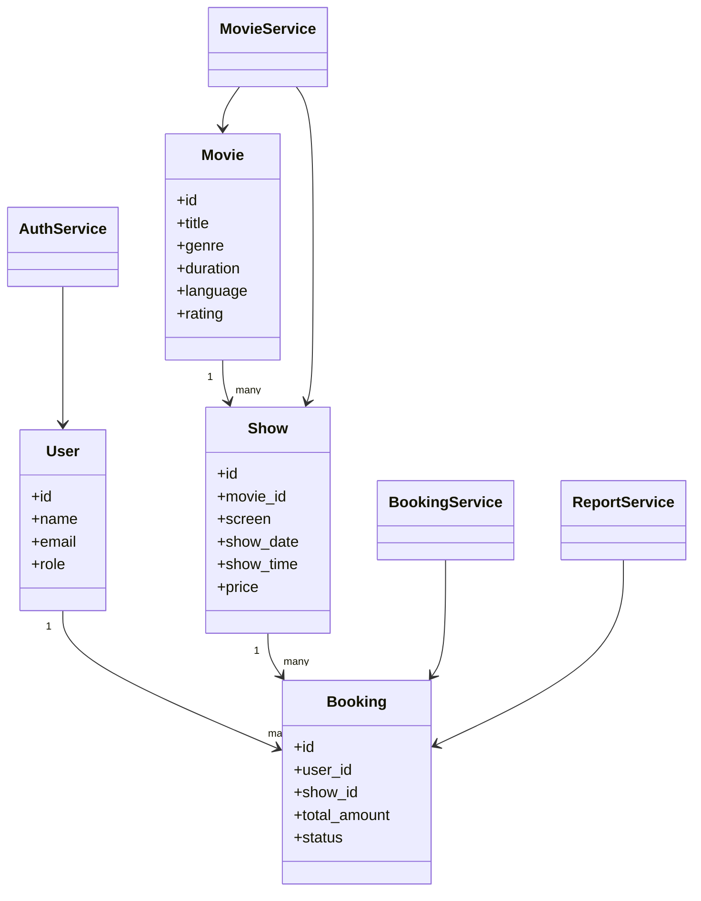
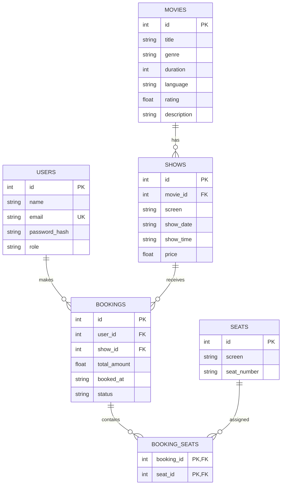

# Design Diagrams

The following Mermaid diagrams can be opened in GitHub, Mermaid Live Editor, or a Markdown editor that supports Mermaid.

## 1. System Architecture

## 2. Workflow Diagram

## 3. Use Case Diagram

## 4. Sequence Diagram - Booking

## 5. Class / Component Diagram

## 6. ER Diagram

